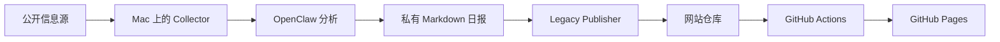

# Horizon Radar

Horizon 是运行在个人 Mac 上的技术情报系统与静态知识站点。它从公开来源采集变化，经分析形成日报，帮助维护者判断哪些内容值得阅读、测试或处理。

**在线阅读：[Horizon](https://muhnchiu.github.io/)**

## 核心功能

- **AI**：模型、论文、推理工具与 Agent 生态。
- **DEV**：开发工具、工程实践与 AI Coding。
- **SKILL**：Agent Skills、MCP 与可复用工作流程。
- **APP**：效率应用、新软件与替代工具。
- **SEC**：漏洞、公告与安全处置线索；网站目录名为 `security`。
- 按日期归档日报，并提供 Research、Topics、Stack 和搜索入口。
- 同一内容提供繁体与简体页面。

## 系统架构



网站仓库负责页面、公开内容格式和静态构建。采集脚本属于 `script-manager`；冻结契约与策略通过 `vendor/` 下的独立仓库分发。跨仓库使用手册集中维护在本仓库 `docs/01`–`09`，其他组件可链接到这里，避免复制多份完整手册。

## 当前状态

截至 **2026-10-08**，已有 Legacy 日报与 Pages 发布流程。网站 `src/content/radar/` 目前按 **V1 Schema** 校验；V2 的 Normalizer、Validator、Identity、Registry 等已有代码与验证材料，但这些材料不自动授予完整 V2 生产发布权限。

| 路径或门禁 | 状态与边界 |
| --- | --- |
| Legacy Publisher → Actions → Pages | 既有日报发布路径；每批仍需验证构建和页面 |
| Contract 2.1.2 | 当前版本化 Event Identity 契约；历史包不可重写 |
| Domain Snapshot Profile 2.0 / Trusted Head | NOT_FROZEN / BLOCKED |
| 受相关门禁约束的 Runtime Authorization / Provider Qualification | NOT_GRANTED / BLOCKED |
| 完整受治理 V2 Publisher | 未解锁；Legacy 发布成功不构成授权 |
| Phase 9.2 能力债务 | 3 OPEN / 0 CLOSED；整体 INCOMPLETE |

状态来源及尚待验收的项目见[路线图](docs/09-roadmap.md)。本说明是使用入口，不是运行授权。

## 文档导航

| 文档 | 内容 |
| --- | --- |
| [01 项目概览](docs/01-overview.md) | 目标、演进、术语与仓库职责 |
| [02 系统架构](docs/02-architecture.md) | 数据流、组件和公开边界 |
| [03 五套雷达](docs/03-radars.md) | 各类定位、来源与阅读方法 |
| [04 处理流水线](docs/04-pipeline.md) | 采集、分析、身份、去重和评分 |
| [05 数据契约](docs/05-contracts.md) | V1、2.0、2.1.2 与兼容规则 |
| [06 日常维护](docs/06-operations.md) | 开发、构建、发布与巡检 |
| [07 故障排查](docs/07-troubleshooting.md) | 缺报、构建失败和恢复顺序 |
| [08 治理门禁](docs/08-governance.md) | 冻结、授权和能力债务 |
| [09 当前路线图](docs/09-roadmap.md) | 已完成、待核验与后续工作 |

## 本地开发

需要 Git、Node.js 与 npm；CI 当前使用 **Node.js 24**。首次克隆需初始化 submodule：

```bash
git clone --recurse-submodules https://github.com/muhnchiu/muhnchiu.github.io.git
cd muhnchiu.github.io
npm ci
npm run dev
```

`npm run dev` 显示简体源文案。`npm run build` 会运行 prebuild 校验与测试，再构建 Astro 页面并生成简繁两套页面；`npm run preview` 用于查看构建结果。构建会写入输出文件，不能用于要求零写入的审计。

维护时先查看[运行手册](docs/06-operations.md)和[排障入口](docs/07-troubleshooting.md)。本次文档整理不执行采集、发布、部署或资格验证调用。

## 中文显示与字体

`src/content/` 的简体 Markdown 是内容源。构建后，OpenCC 将默认路由转为繁体，并在 `/zh-hans/` 生成简体副本；语言切换保留对应页面，两种版本分别设置 canonical 与语言替代链接。

转换仅作用于可读文本和描述性元数据，保留 URL、slug、ID、代码、脚本及数据属性。需保持原字形的名称可加入 `scripts/build-locales.mjs` 的 `protectedTerms`，或使用 `<span translate="no">...</span>`。

## Typography

English text and the HORIZON wordmark use Geist. Research H1/H2 and Radar H1 use Iansui (芫荽), with LXGW WenKai TC as a fallback. Featured article titles also use Iansui; quotations retain LXGW WenKai TC. Chinese body text uses Noto Sans TC or a system Traditional Chinese sans-serif. Dates, signals, metadata, and code use Geist Mono.

The bundled [Iansui](https://github.com/ButTaiwan/iansui), [LXGW WenKai TC](https://github.com/lxgw/LxgwWenkaiTC), [Geist](https://github.com/vercel/geist-font), and Geist Mono fonts use the SIL Open Font License 1.1. License files are supplied by the installed Fontsource packages.
