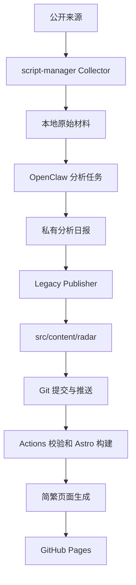

# 系统架构与数据流

[返回项目入口](../README.md) · [下一章：雷达](03-radars.md)

## 日常发布路径

Mac 承载采集、会话与私有状态；OpenClaw 承载任务与分析；GitHub 保存公开代码和报告；Pages 只展示静态构建结果，不运行 Collector 或模型。

## V2 模块路径

V2 的逻辑处理链为 Candidate → Evidence → Normalizer / Validator → Event Identity → Observation Identity → Registry → Score / Action → Publication。各阶段的实现、测试、激活和授权需分别判断。此图示不表示完整路径已在日常生产启用。

Registry-only Canary 只证明隔离身份处理的范围，不能据此声明 Score Ready、Publication Ready 或 Production Ready。具体历史授权依原任务证据判断。

## 网站目录

| 路径 | 用途 |
| --- | --- |
| `src/pages/` | 首页、雷达、日期归档、研究、主题、Stack、搜索 |
| `src/content/radar/` | 五类公开日报；当前 V1 内容集合 |
| `src/content/research/` | 长期研究文章 |
| `src/content/topics/` | 主题聚合元数据 |
| `src/content/stack/` | 经公开审核的工具栈说明 |
| `src/content.config.ts` | Astro 内容 Schema |
| `src/lib/` | 消费者、身份、验证与其他处理模块 |
| `scripts/`、`tests/` | 工具与验证入口 |
| `vendor/` | 契约和策略 submodule |
| `.github/workflows/deploy.yml` | Pages 构建部署 |

## 公开与私有边界

公开层只保留允许展示的报告、来源、内容元数据与说明。原始运行状态、个人依赖清单、Registry、过滤诊断、认证绑定材料与密钥保留在私有环境。

公开文档使用仓库相对路径与组件名称，省略本机绝对路径、账号内部配置和私有状态内容。`publish: true` 仍需配合内容审核和正确发布路径，不代表任意私有工件可公开。

## 三个独立成功条件

采集完成需有原始材料；分析完成需有可用日报；发布完成需同时核验 Git、Actions 和公开页面。一个条件满足不会自动满足后两个。
